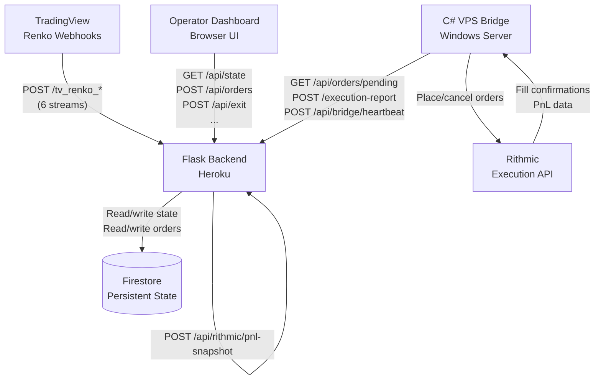

# OperatorLock

[](https://turangenesis.github.io/OperatorLock/) &nbsp;[](LICENSE)

**A behavioral risk-control and execution infrastructure system for high-pressure financial environments.**

> ### ▶ [**Try the live interactive demo →**](https://turangenesis.github.io/OperatorLock/)
> A fully simulated walkthrough of the operator console — watch every constraint (5-minute candle lock, 180-second post-exit cooldown, tempo token, zone entry gate, daily trade limit) fire in real time. **No login, backend, or API keys required.** See [demo/](demo/) for details.

OperatorLock enforces structural discipline on a futures trading operator through hard gates, temporal locks, and cooldown periods that cannot be overridden in the heat of the moment. It is not a prediction engine, signal generator, or automated trading strategy. The system's job is to make impulsive behavior physically impossible — protecting the operator from themselves when discipline is most likely to fail.

---

## The Problem

In high-stakes financial environments, willpower-based risk management fails under stress. An operator who knows the rules will still break them when:

- A losing trade is close to recovery ("just one more minute")
- A winning trade feels like it should run further ("this one is different")
- A drawdown triggers urgency ("I need to make this back")

Traditional platforms offer warnings and confirmations. OperatorLock removes the choice entirely.

---

## Core Innovation: Structural Constraints

Every behavioral constraint is implemented as a hard gate that the API enforces at the server. There is no "confirm anyway" button. The constraints aren't reminders — they are walls.

| Constraint | Mechanism |
|---|---|
| **5-Minute Candle Lock** | One entry per 5-minute candle boundary. The API rejects all subsequent entries until the next candle. |
| **Post-Exit Cooldown** | 180-second hard block after any position close. The cooldown cannot be dismissed — it counts down. |
| **Tempo Token** | One entry per 6pt Renko bar. Spending the token on an entry requires a new bar to re-arm it. |
| **Initial Exit Lock** | Exits blocked for the first 6pt bar after entry. Forces the operator to hold through the initial move. |
| **2.5pt Management Lock** | Automatic lock on TP/protect adjustments until the 2.5pt Renko confirms the trade direction. |
| **Zone Entry Gate** | The 8pt and 12pt structure must agree (or operator must explicitly commit to a direction in FREE zone). |
| **Daily Trade Limit** | Hard cap on entries per calendar day. Once reached, the API returns 409 regardless of how good the setup looks. |
| **Daily Stop Loss** | Configurable equity drawdown trigger. Once hit, all open positions are exited and entries are blocked for the rest of the day. |
| **Scale-In Gate** | Adding to a position requires explicit bar confirmation. Not available on demand. |

---

## System Architecture



### Component Responsibilities

**Flask Backend (Python/Heroku)**
- Receives Renko color updates from TradingView (6 separate streams)
- Enforces all behavioral constraints before accepting order creation requests
- Persists state to Firestore across dyno restarts
- Exposes a polling endpoint for the VPS bridge to claim pending orders
- Receives execution reports (fills, rejections, cancellations) from the bridge

**VPS Bridge (C#/Windows Server)**
- Polls the backend every second for pending orders
- Executes orders via Rithmic's native API (not REST)
- Reports execution status back to the backend
- Sends PnL snapshots every few seconds for position tracking and auto-exits

**Firestore**
- Sole persistence layer — no database schema migrations, no SQL
- Stores per-asset state (position, entry price, lock state, Renko colors) and global state
- Hydrated into memory on backend startup; written on every meaningful state change

**TradingView**
- Sends Renko bar color changes via webhook alerts (green/red/neutral)
- Six independent streams: 1pt (visual), 2.5pt (filter), 4pt (invalidation), 6pt (main/tempo), 8pt (structure), 12pt (macro)
- Acts as the behavioral engine's clock — constraint logic is bar-driven, not time-driven

---

## Tech Stack

| Layer | Technology |
|---|---|
| Backend API | Python 3, Flask, gunicorn |
| Persistence | Google Cloud Firestore |
| Deployment | Heroku (backend), Windows VPS (bridge) |
| Execution bridge | C# (.NET), Rithmic RAPI+ |
| Market data / signals | TradingView (Renko bar webhooks) |
| Frontend | Vanilla JS, HTML/CSS (single-file) |

---

## Repository Structure

```
OperatorLock/
├── backend/                    # Python Flask application
│   ├── app.py                  # App factory — registers blueprints, hydrates state
│   ├── auth.py                 # Session-based dashboard authentication
│   ├── config.py               # Environment variable loading
│   ├── requirements.txt
│   ├── Procfile
│   ├── routes/
│   │   ├── webhooks.py         # TradingView Renko webhook handlers
│   │   ├── orders.py           # Order creation, pending poll, execution reports
│   │   ├── controls.py         # Operator control APIs (exit, TP, protect, toggles)
│   │   ├── bridge.py           # VPS bridge communication endpoints
│   │   └── state.py            # /api/state and dashboard entry point
│   ├── services/
│   │   ├── state_manager.py    # In-memory state dict, Firestore hydration
│   │   ├── behavioral_engine.py # Constraint enforcement — the core innovation
│   │   ├── execution_engine.py # Order lifecycle, fill handling, position management
│   │   └── exit_engine.py      # Auto-exit paths (TP, protect, daily stop)
│   ├── stores/
│   │   ├── orders_store.py     # Firestore order read/write
│   │   ├── state_store.py      # Firestore state persistence
│   │   └── pnl_store.py        # PnL calculations
│   ├── utils/
│   │   ├── type_helpers.py     # safe_float, safe_int, scrub_nonfinite
│   │   ├── direction.py        # Direction normalization (BUY/SELL/green/red)
│   │   └── calendar.py         # NY trading calendar, low-liquidity day detection
│   └── static/
│       └── index.html          # Operator dashboard UI
│
├── vps/                        # C# Rithmic execution bridge
│   ├── README.md
│   ├── src/
│   │   ├── Program.cs          # Bridge entry point
│   │   └── Config.cs           # Non-secret configuration scaffold
│   └── Config.secrets.example.cs  # Secret field placeholders (real file gitignored)
│
└── docs/
    ├── architecture.md         # System design and data flows
    ├── behavioral-constraints.md # Constraint catalogue with design rationale
    ├── deployment.md           # Heroku, VPS, Firestore setup
    └── api-reference.md        # All endpoints: method, auth, request/response
```

---

## Quick Start

### Prerequisites

- Python 3.11+
- A Google Cloud project with Firestore enabled and a service account JSON key
- A Heroku account (or any server that can run gunicorn)
- A Rithmic account and Windows VPS for the bridge (optional — backend runs without it)

### Backend Setup

```bash
# Clone and enter the backend directory
git clone <repo-url>
cd OperatorLock/backend

# Install dependencies
pip install -r requirements.txt

# Configure environment
cp ../.env.example .env
# Edit .env — set BRIDGE_HEARTBEAT_SECRET, FLASK_SECRET_KEY, GOOGLE_CLOUD_CREDENTIALS

# Run locally
flask run
# or
gunicorn app:app
```

### Environment Variables

See [.env.example](.env.example) for the full list. Required variables:

| Variable | Purpose |
|---|---|
| `FLASK_SECRET_KEY` | Session cookie signing key |
| `BRIDGE_HEARTBEAT_SECRET` | Shared secret for VPS bridge authentication |
| `GOOGLE_CLOUD_CREDENTIALS` | Full Firestore service account JSON (single-line) |
| `DASHBOARD_PASSWORD` | Operator dashboard login password (leave empty to disable auth) |

### VPS Bridge Setup

See [vps/README.md](vps/README.md) for build and deployment instructions.

Copy `vps/Config.secrets.example.cs` to `vps/Config.secrets.cs` and fill in your Rithmic credentials, server endpoint, and `BRIDGE_HEARTBEAT_SECRET`.

---

## Further Reading

- [Architecture](docs/architecture.md) — Component diagram, data flows, state machine
- [Behavioral Constraints](docs/behavioral-constraints.md) — Every constraint explained with design rationale
- [Deployment](docs/deployment.md) — Step-by-step production setup
- [API Reference](docs/api-reference.md) — All endpoints
